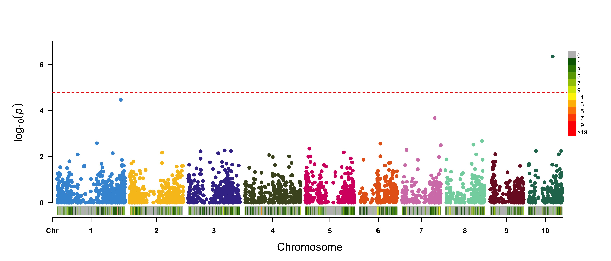

### Caso 4: Análisis GWAS

Este repositorio contiene códigos de programación en lenguaje R para realizar un análisis GWAS con el paquete [rMVP](https://cran.r-project.org/package=rMVP).

El set de datos proviene del tutorial para el software TASSEL (Bradbury, 2007). Los datos, que se pueden obtener [aquí](https://tassel.bitbucket.io/docs/TASSELTutorialData5.zip), consisten en genotipos SNPs (m = 3093 marcadores) de 281 individuos de maíz (número haploide de cromosomas x= 10). Las variables fenotípicas son *EarHT*: altura de mazorca; *dpoll*: tiempo (días) a florecer; *EarDia*: diámetro de mazorca.

Referencia: Bradbury, P.J., Zhang Z., Kroon D.E., Casstevens T.M., Ramdoss Y., y Buckler E.S. (2007). TASSEL: Software for association mapping of complex traits in diverse samples. Bioinformatics 23:2633-2635.

